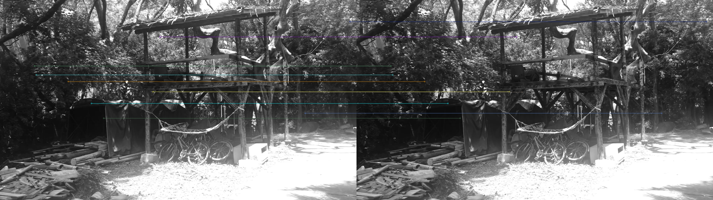
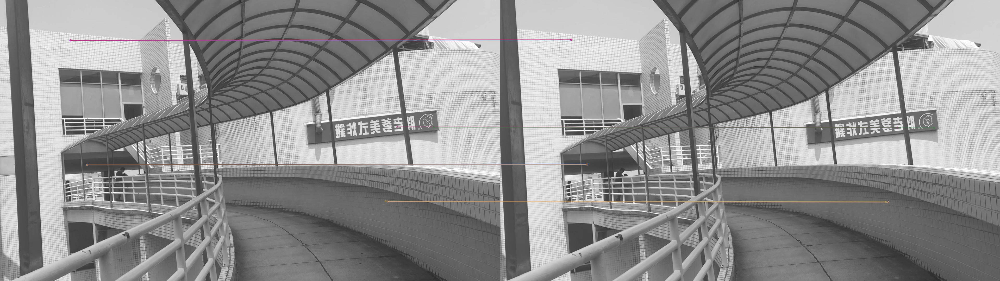
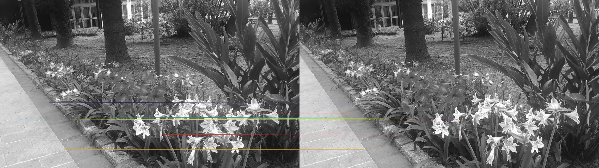
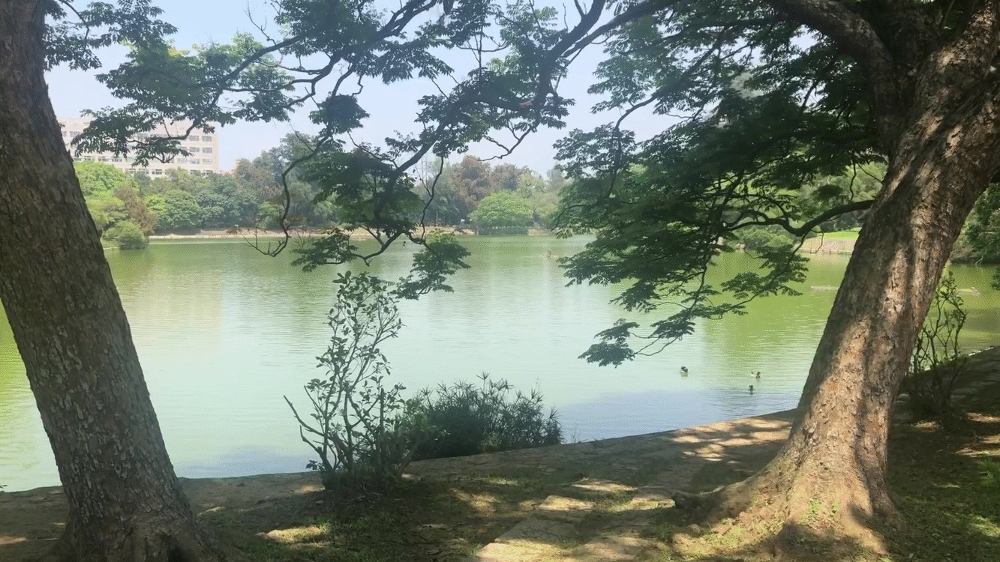

## 1.Take a sequence of moving-forward images in NTHU campus

**a.腳踏車廢器區**

**b.走去吃胖老爹**

**c.欣賞竹湖**

**d.清大花園**

## 2.Show feature extraction and matching results between two images
[實作過程請參閱此link](https://colab.research.google.com/drive/1sn6nira08AclU3xzaY3CkKlx9yZMHLAt#scrollTo=R8teSbWVkDZ5),

如下圖，首先我們使用SIFT來找出feature sift

## 3.Perform image alignment and generate infinite zooming effect

使用BRISK演算法結果找出frature match result

**a.走去吃胖老爹**

**b.欣賞竹湖**

**c.清大花園**

## 4.implement different feature extrators, e.g. SIFT, SURF, and compare the results

## 5.Enhance effect by using photoshop. 

## 6.比較所有演算法
